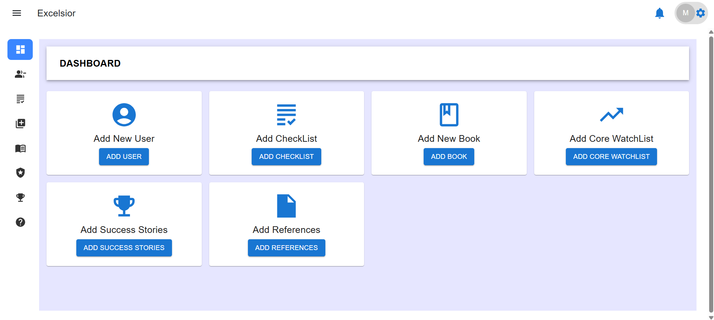

# Trade Excelsior

<div align="center">
    
</div>

## 📋 Table of Contents

1. [Introduction](#-introduction)
2. [Tech Stack](#-tech-stack)
3. [Features](#-features)
4. [Quick Start](#-quick-start)
5. [Installation](#-installation)
6. [Deployment](#-deployment)

---

## 🚀 Introduction

Trade Excelsior is a modern, user-friendly web application for managing books, onboarding checklists, watchlists, references, success stories, and user support. Built with Vite and React, it provides a fast, responsive, and intuitive experience for both admin and user roles. The platform features role-based routing, modular components, and a clean UI for efficient workflow management.

### What is this repository for?

- Trade Excelsior Admin/User Portal
- Version: 1.0

---

## ⚙️ Tech Stack

- **Vite:** Fast build tool and development server for modern web projects.
- **React:** Component-based JavaScript library for building user interfaces.
- **React Router v6+:** Declarative routing for React applications, supporting nested routes and dynamic navigation.
- **Bootstrap:** Popular CSS framework for responsive and mobile-first design.
- **Material-UI (MUI):** React UI framework for fast, beautiful, and accessible components.
- **ESLint:** Code quality tool to enforce best practices and maintain code consistency.

---

## ⚡️ Features

- **Role-Based Routing:** Separate admin and user dashboards with dynamic route switching.
- **Book Management:** Add, edit, and delete books with modal forms.
- **Onboarding Checklist:** Manage onboarding tasks and checklists for users.
- **Core Watchlist:** Track and edit core watchlist items and trends.
- **References:** Add, edit, and delete reference materials.
- **Success Stories:** Share and manage user success stories.
- **Support System:** User support cards and details for help and feedback.
- **Profile Management:** Update profile and change password features.
- **Responsive Design:** Fully responsive layout for all devices.
- **Modern UI:** Clean, attractive interface using Bootstrap and MUI.

---

## 👌 Quick Start

### Prerequisites

- Node.js 18+
- npm 9+

### Installation

```bash
# Install dependencies
npm install

# Start development server
npm run dev

# Build for production
npm run build

# Preview production build
npm run preview
```

---

### Contribution guidelines

- Open issues for bugs or feature requests
- Submit pull requests for improvements
- Follow code style and best practices

### Who do I talk to?

- Trade Excelsior Team

---
